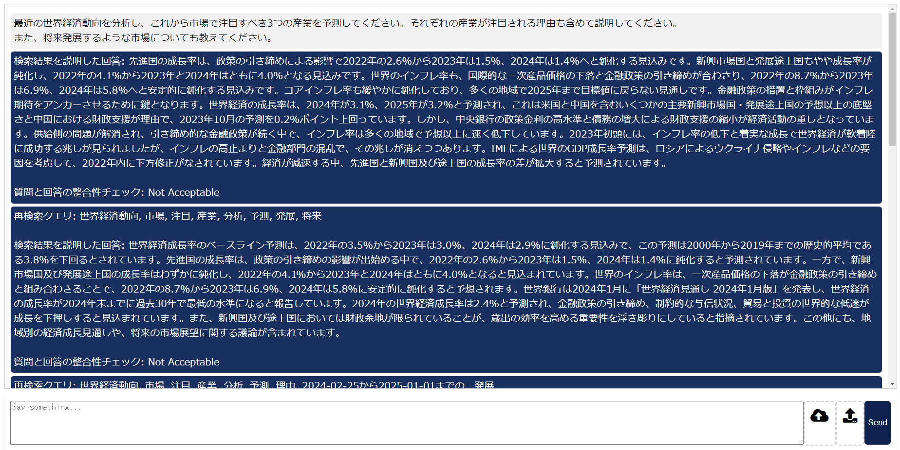
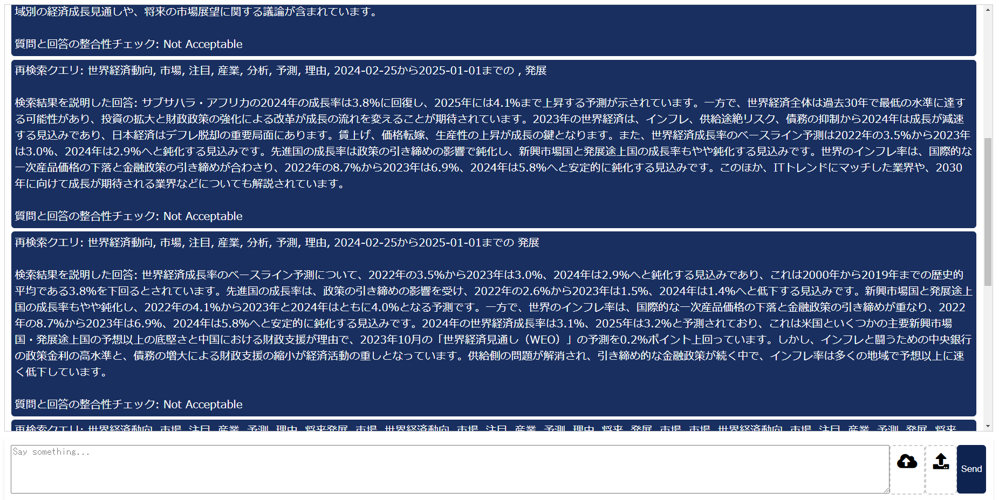
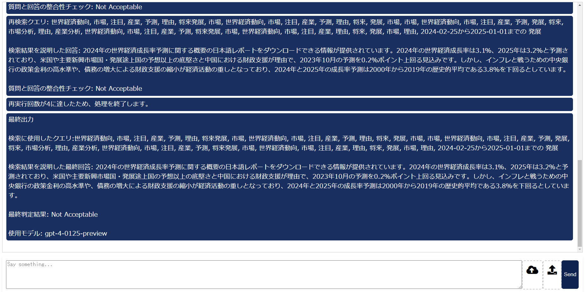
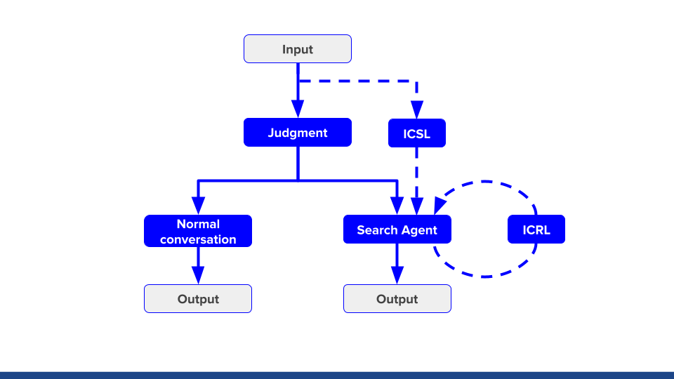
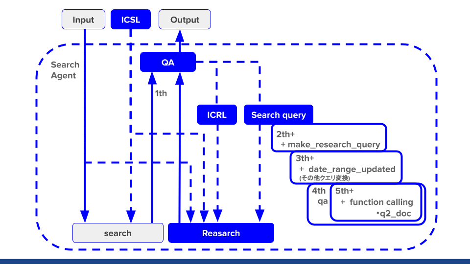
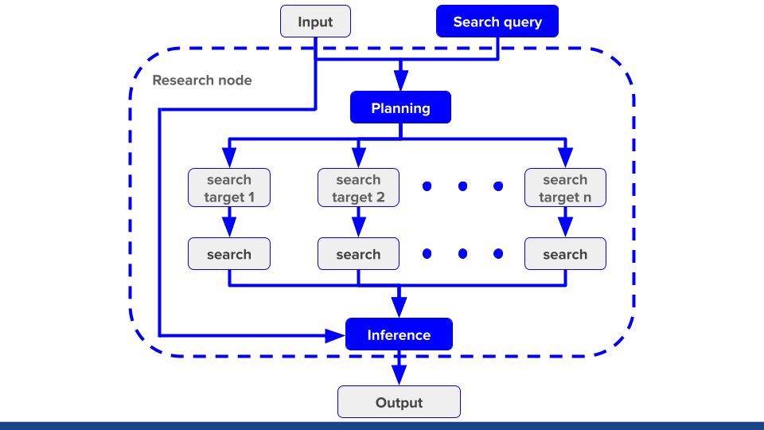

# LLM を使用した外部検索 RAG Agent

入力に対し、検索を行うか、LLMの知識でかいとうするかを自動判断します。
入力に対し、検索を行うと判断した時

質問に対して検索を行い、質問と検索結果を見せ、使用しているモデルが再検索した方が良いかを判断させます。
判断の結果再検索を行う場合、そこから最大4回検索を行い、徐々に検索のための処理を足しながら再建策を行います。

## 実行イメージ

## アーキテクチャイメージ

- References
    - [Efficient Streaming Language Models with Attention Sinks](https://arxiv.org/abs/2309.17453)
    - [Query2doc: Query Expansion with Large Language Models](https://arxiv.org/abs/2303.07678)
    - [PokéLLMon: A Human-Parity Agent for Pokémon Battles with Large Language Models](https://arxiv.org/abs/2402.01118)