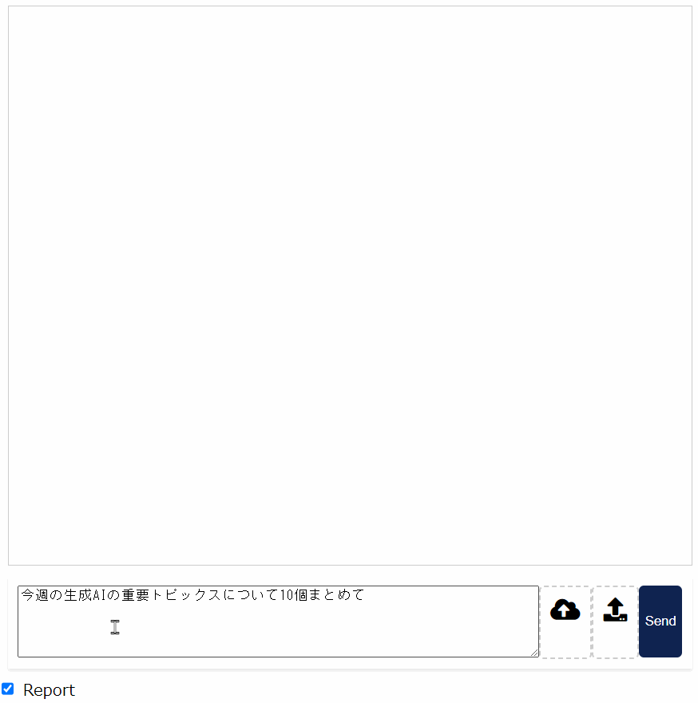
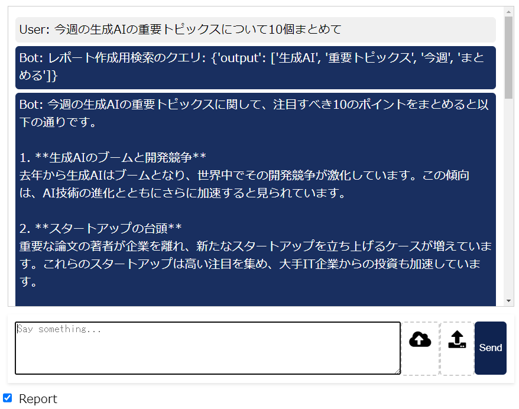
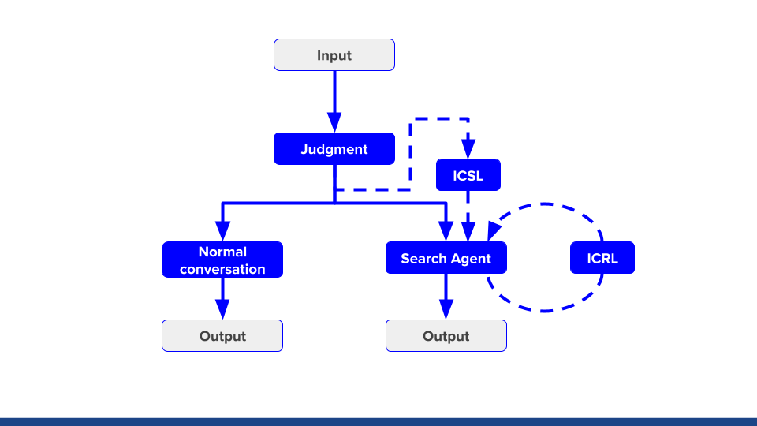
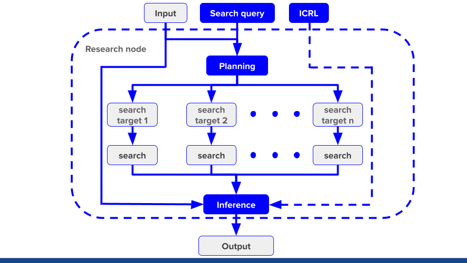

# LLM を使用した外部検索 Agent

入力に対し、検索を行うか、LLMの知識で回答するかを自動判断します。
入力に対し、検索を行うと判断した時

質問に対して検索を行い、質問と検索結果を見せ、使用しているモデルが再検索した方が良いかを判断させます。
判断の結果再検索を行う場合、そこから最大4回検索を行い、徐々に検索のための処理を足しながら再検索を行います。

## Report

Reportのチェックを入れることで一度の検索で質問に対応する調査報告書をMarkdown形式で出力します

調査報告書作成の実行結果イメージ

## 実行イメージ

## アーキテクチャイメージ

- References
    - [Efficient Streaming Language Models with Attention Sinks](https://arxiv.org/abs/2309.17453)
    - [Query2doc: Query Expansion with Large Language Models](https://arxiv.org/abs/2303.07678)
    - [PokéLLMon: A Human-Parity Agent for Pokémon Battles with Large Language Models](https://arxiv.org/abs/2402.01118)